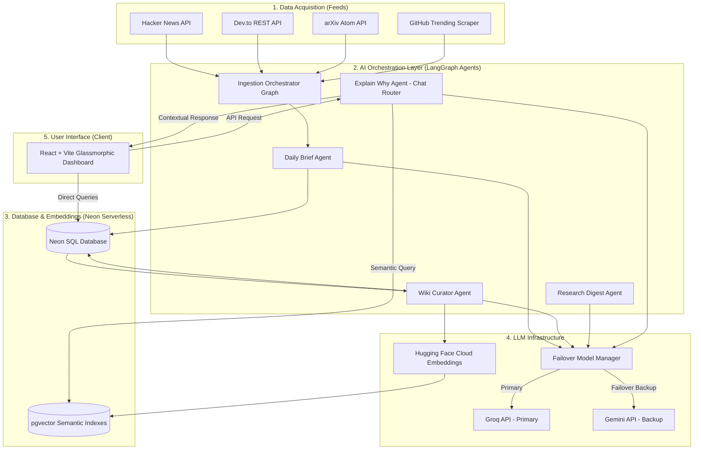

# 🚀 Dev Patrika: AI-Powered Developer Intelligence Platform
### *Bridging the Gap Between Noise and Actionable Engineering Insights*

---

## 📌 Executive Summary

In the modern software engineering landscape, developers, tech leads, and technology organizations face a critical bottleneck: **information overload**. Between thousands of daily research papers on arXiv, trending GitHub repositories, tech newsletters, Hacker News updates, and community forums, staying ahead of tech trends is a full-time job. 

**Dev Patrika** is a premium, enterprise-grade **Developer Intelligence Platform** designed to solve this. It acts as an autonomous knowledge pipeline that crawls the tech ecosystem, dedupes and summarizes information, extracts new terminology, builds a semantic dictionary (Wiki), and provides an interactive conversational RAG (Retrieval-Augmented Generation) assistant. 

By utilizing a state-of-the-art **Multi-Agent LangGraph system**, serverless **Neon Postgres with pgvector**, and a premium **React/Vite glassmorphism dashboard**, Dev Patrika turns noisy developer updates into curated, structured, and searchable organizational intelligence.

---

## 💡 The Value Proposition: Why Dev Patrika?

### 1. Zero-Noise Engineering Intelligence
Instead of wasting hours browsing multiple platforms, engineering teams get a single curated feed containing high-signal summaries of relevant updates, categorized automatically (e.g., AI, Web Dev, DevOps, Cybersecurity).

### 2. Auto-Expanding Tech Glossary (Dev Wiki)
As new libraries (e.g., *LangGraph*, *Vite v6*, *Neon*) emerge, Dev Patrika automatically extracts them, creates precise definitions, links official resources, and indexes them semantically. This serves as an instantly updated onboarding glossary for developers.

### 3. Conversational RAG with Contextual Memory
Developers can chat with the platform to ask complex questions (e.g., *"What is the latest trend in stateful multi-agent systems and how does it compare to standard chains?"*). The system retrieves information semantically, provides direct source citations, and keeps track of thread memory.

### 4. Effortless Weekly Executive Digests
A weekly compiler scans the momentum of technical topics, star metrics of github repos, and top news to compile an editorial newsletter digest automatically.

---

## 🏗️ High-Level System Architecture

Dev Patrika's design prioritizes a low-latency, scalable, and cost-effective serverless architecture.



---

## 🛠️ The Tech Stack (Under the Hood)

### 🔹 Backend Engine
* **FastAPI**: Asynchronous, high-performance web API framework.
* **SQLModel**: Combined Pydantic and SQLAlchemy mapping, ensuring strict type-safety.
* **Neon Postgres**: Serverless Postgres database with auto-scaling capabilities.
* **pgvector**: High-speed, SQL-native vector similarity matching (Cosine Distance).
* **LangGraph (LangChain)**: Orchestrates complex pipelines into stateful, traceable agents with failover model support.
* **Hugging Face Cloud Inference**: Uses `BAAI/bge-small-en-v1.5` embeddings (384 dimensions) for zero-RAM overhead, making it extremely cost-effective.
* **Brevo SMTP API**: OTP passwordless authentication and authenticated developer feedback pipeline.

### 🔹 Frontend client
* **React + Vite**: Light-speed, hot-reloading development environment and minimal bundle sizes.
* **Tailwind CSS v4**: Utility-first styling with modern native-CSS theme tokens.
* **Zustand**: Lightweight global client state management (layouts, sessions, chat history).
* **TanStack Query (React Query)**: Automated API caching, queries, and optimistic state updates.
* **Framer Motion**: Smooth animations, transition-effects, command palettes, and slide-over drawers.

---

## 🌟 Key Features & Capabilities

### ⚡ Autonomous Multi-Agent Workflows
Unlike traditional sequential code, Dev Patrika organizes tasks using **LangGraph StateGraphs**:
1. **DailyBriefAgent**: Oversees crawling, parsing, formatting, and classification.
2. **WikiCuratorAgent**: Scans updates for emerging terms. If a term already exists, it uses a **Merge Prompt** to combine new and old knowledge instead of creating duplicate records.
3. **ResearchDigestAgent**: Handles dense documents (such as arXiv preprints), recursively chunks text, and translates academic jargon into plain English.
4. **ExplainWhyAgent**: Acts as a stateful ReAct (Reasoning and Action) conversational agent that determines when to query pgvector and when to answer from internal state.

### ⚡ Two-Tier Deduplication (Fuzzy Title Matcher)
To prevent feed spam, the system employs:
* A unique URL index check at the SQL layer.
* A Python-based **Jaccard Fuzzy Title Scorer** that blocks news items with >80% similarity to articles ingested within the last 24 hours.

### ⚡ Double-Layer Failover Engine
If the primary LLM provider (Groq) experiences rate limits or timeouts, the orchestrator instantly switches the prompt context to Google Gemini (`gemini-2.5-flash`), guaranteeing 100% uptime for real-time applications.

### ⚡ Enterprise Authentication & Security
* Dual-token JWT Strategy (Access & Refresh tokens).
* Security credentials signed with HS256 algorithm.
* Out-of-the-box support for OAuth 2.0 (Google, GitHub) and passwordless verification using email OTPs (One-Time Passwords).

---

## 📈 Pitching Dev Patrika to Organizations (Business Angles)

When presenting Dev Patrika to senior leadership, highlight these key dimensions of business value:

### 💼 Scenario A: Boosting Developer Productivity
* **The Cost of Friction**: The average software engineer spends up to 2 hours a day reading documentation, research, or news to solve technical hurdles.
* **The Dev Patrika Solution**: Centralizing developer updates and enabling RAG search against verified sources saves up to **10-15% of engineering research time** per developer.

### 💼 Scenario B: Accelerated Developer Onboarding
* **The Onboarding Gap**: New hires struggle to learn custom stacks and emerging internal terms.
* **The Dev Patrika Solution**: The Dev Wiki automates the curation of terms, libraries, and frameworks, keeping a fresh glossary of official documentation links and descriptions ready for new recruits.

### 💼 Scenario C: Tracking Technology Trends & Risks
* **The Tech-Debt Risk**: Organizations often miss when critical dependencies become deprecated or when new, safer alternatives emerge.
* **The Dev Patrika Solution**: GitHub Trending integration and news crawls capture security trends, major library releases, and architectural shifts, alerting leads via the Weekly Digest.

---

## 🗺️ Product Roadmap

```
  v1.0 (Core Engine) 🚀      v2.0 (Modern Cloud) ☁️      v3.0 (Enterprise) 🏢
   • SQLite Database         • Neon Postgres Migration  • Collaborative Wikis
   • Linear LLM chains       • pgvector Semantic Search • Slack & Teams Bot Integration
   • Simple Cron Fetch       • LangGraph Multi-Agents   • Custom Doc Ingest (PDF/Wiki)
   • Basic React Dashboard   • Google & GitHub OAuth    • RBAC Role-Based Permissions
```

---

## 🎯 Conclusion

**Dev Patrika** represents a paradigm shift in how technical organizations capture, process, and act on engineering knowledge. By pairing agentic LangGraph workflows with a beautiful, performant React application, it provides developers with the insights they need, exactly when they need them. 

*Let's empower our development teams with intelligence, not noise.*
