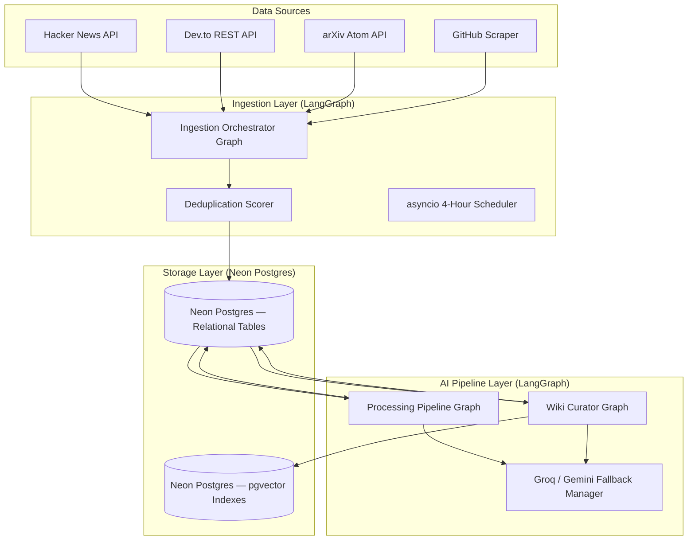
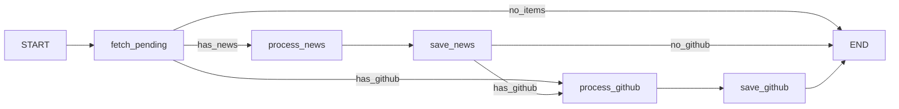
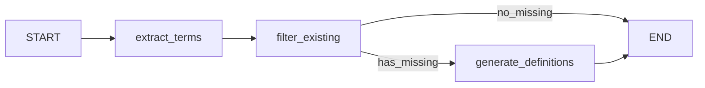
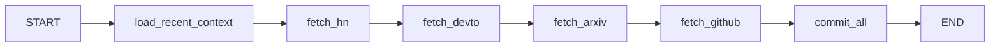

# Dev Patrika: Backend Engine Overview

This document provides a professional reference summary of the **Dev Patrika** backend engine architecture, capabilities, and API endpoints implemented up to `v2.0`.

---

## 🏗️ System Architecture

Dev Patrika's backend is a modular developer intelligence engine built using **FastAPI**, **SQLModel (SQLAlchemy)**, **LangChain**, and **LangGraph**. The system uses **Neon (Postgres + pgvector)** as a unified storage layer — relational tables for structured records and pgvector indexes for semantic vector lookups. All AI pipelines are orchestrated as **LangGraph StateGraphs** for traceability and observability via LangSmith.

---

## 🎯 Key Capabilities & Core Engines

### 1. Multi-Source Ingestion Engine
* Automatically crawls and extracts tech updates from the developer ecosystem:
  * **Hacker News**: Firebase REST API (top stories) — **10 items per cycle**.
  * **Dev.to**: RSS/API endpoints matching tech tags (Python, Web Dev, DevOps, AI, Security) — **3 items per tag**.
  * **arXiv**: Public Atom feeds for Computer Science and Machine Learning preprints (`cs.AI`, `cs.LG`, `cs.SE`) — **5 items per cycle**.
  * **GitHub**: Scrapes daily trending repository metrics (languages, descriptions, stars).
* **Architecture**: Implemented as a 6-node LangGraph StateGraph (`load_recent_context → fetch_hn → fetch_devto → fetch_arxiv → fetch_github → commit_all`).

### 2. Duplication & Overlap Control
* Prevents data pollution through a two-tiered check:
  * **Unique URL Index**: Postgres constraint blocks duplicate URLs on insertion.
  * **Fuzzy Title Scorer**: Computes Token-based Jaccard similarity. Stories with **>80% similarity** to articles ingested in the last 24 hours are skipped, maintaining diverse topics.

### 3. Asynchronous Scheduler
* Integrates a non-blocking `asyncio` task loop running inside the FastAPI lifespan context.
* Polls data feeds automatically every **4 hours** and sequences five phases: Ingestion → News Summarization → Vector Indexing → Wiki Curation → Trending Analysis.
* Ingestion limits are intentionally kept low per cycle to prevent API quota exhaustion across LLM providers (Groq, Gemini). Smaller, more frequent batches allow rate limits to recover between cycles.

### 4. AI Summarization & Classification Pipeline
* Leverages LangChain's `RunnableSequence` to transform raw descriptions/abstracts into structured, professional markdown.
* **Architecture**: Implemented as a 5-node LangGraph StateGraph with conditional routing (`fetch_pending → process_news → save_news → process_github → save_github`).
* **Unified Summary Format**:
  * **Overview**: Concise 1-2 sentence introduction of the news item.
  * **Key Details**: 3-4 bullet-point takeaways.
  * **Community & Traction**: Popularity, developer activity, and adoption context.
* **AI Categorizer**: Classifies stories into tech buckets (*AI, Web Dev, Cybersecurity, Startups, Open Source, Cloud/DevOps*).
* **GitHub "Why it Matters" Radar**: Evaluates trending repos to detail architectural highlights and developer-focused summaries.

### 5. Multi-Provider LLM Fallback (Failover Engine)
* Uses native LangChain model fallbacks to guarantee uptime:
  * **Primary Model**: Groq (`openai/gpt-oss-120b`).
  * **Secondary Backup**: Google Gemini (`gemini-2.5-flash`).
  * If the primary model encounters rate limits, timeouts, or authentication issues, it fails over to the backup instantly and silently.

### 6. Dev Wiki Compiler
* Automatically compiles a dictionary of technical concepts on-demand.
* Extracts structured definitions, context on why the term is trending, and verified official resource links.
* Uses native Postgres JSONB for `related_links` storage.

### 7. Unified Vector Store & Semantic Search Engine (pgvector)
* Unified on **Neon Postgres with pgvector** — no separate vector database needed.
* Converts text definitions and articles into vectors using Hugging Face's Cloud Inference API with the **`BAAI/bge-small-en-v1.5`** embeddings model (384 dimensions) via `langchain-postgres` PGVector integration.
* Performs semantic cosine similarity lookup: returns matching concept glossary definitions and related news items based on meaning, bypassing strict keyword matches (e.g., query `"stateful multi-agent systems"` matches `"LangGraph"`).

### 8. Automated Wiki Curation (LangGraph)
* **Architecture**: Implemented as a 3-node LangGraph StateGraph with conditional routing (`extract_terms → filter_existing → generate_definitions`).
* Scans news stories summarized during the scheduler cycle.
* Prompts the LLM (using the fallback chain) to extract key new developer terms or libraries.
* Automatically creates wiki definitions for missing concepts and indexes them via pgvector, building a self-expanding technical glossary.

### 9. Trending Topics Engine
* Scans news updates processed in the last 7 days and tallies keyword references of all active Wiki terms.
* Computes trajectory indicators (`"up"`, `"down"`, or `"stable"`) based on previous frequency counts and saves them in the `trending_topics` table.

### 10. Weekly AI Reports Compiler
* Gathers the past week's top stories, trending github projects, and topics count logs.
* Employs the LLM chain to compile a professional, editorial developer digest report in markdown, which is saved in `weekly_reports`.

### 11. Conversational Memory & Persistent Chatbot
* Connects the `/api/ai/chat` endpoint to a persistent Postgres `chat_messages` table mapping message threads to user session IDs.
* Pulls current dialogue logs dynamically, maintaining memory context across multiple message turns.

### 12. Context Retrieval & Structured Citation Engine
* Executes parallel semantic retrievals on pgvector collections (`wiki_entries` and `news_items`).
* Directs the LLM router to ground answers in the fetched materials, forcing numeric references (like `[1]`, `[2]`), and returns a list of verified clickable URLs in the JSON API payload.

### 13. Technology Evolution Timelines
* Dynamically compiles chronological developmental phases (Announcement ➔ Adoption ➔ Production ➔ Growth) for any technical term using database references and parametric model intelligence.

### 14. Related Articles Recommendations
* Enables semantic recommender widgets on articles.
* Queries pgvector similarity indexes to fetch 3 semantically close articles for every news item.

### 15. Premium Markdown & UI Curation Engine
* Employs custom React parser modules to translate structured Markdown (headers, lists, bold/italic inline tags, dividers, code blocks, and matrices) into premium web UI components.
* Automatically converts unformatted milestone charts into clean, tabular grids under evolution timelines and weekly digests.
* Dynamically normalizes all external links (Wiki references, GitHub redirects) to enforce absolute protocols (`https://`), preventing local path breakage and ensuring seamless routing.

### 16. Authentication & Session Management
* **JWT-based authentication** with Access + Refresh token strategy.
* **Access Token Expiry**: 7 days (`10080 minutes`) — keeps users logged in for extended sessions without re-authentication.
* **Refresh Token Expiry**: 7 days — allows silent token renewal.
* **Multi-provider OAuth**: Supports Google OAuth and GitHub OAuth login flows.
* **OTP Email Login**: Passwordless login via Brevo-powered email OTP (10-minute expiry).
* **Algorithm**: HS256 symmetric JWT signing.

---

## 🔌 API Endpoints Summary

| Method | Endpoint | Description | Lifecycle Group |
|:---|:---|:---|:---|
| **GET** | `/api/health` | Service health status check. | System |
| **GET** | `/api/news` | Retrieve daily news feeds with category, query, and limit filters. | News |
| **GET** | `/api/news/{news_id}` | Retrieve details of a single news article by ID. | News |
| **POST** | `/api/news/ingest` | Triggers background crawlers and initiates LLM processing. | News |
| **POST** | `/api/news/process` | Processes pending raw items in the DB via AI pipeline. | News |
| **GET** | `/api/github/trending` | Returns stored repository radar with AI summaries. | GitHub Radar |
| **GET** | `/api/github/repo/{repo_id}` | Fetch details of a single trending repository by ID. | GitHub Radar |
| **GET** | `/api/wiki` | Returns list of concept definitions with autocomplete query support. | Dev Wiki |
| **GET** | `/api/wiki/{term}` | Fetch case-insensitive wiki entries. | Dev Wiki |
| **POST** | `/api/wiki/generate` | Dispatch LangChain worker to generate concept definitions. | Dev Wiki |
| **GET** | `/api/wiki/{term}/timeline` | Generate chronological evolution timeline for a tech term. | Dev Wiki |
| **GET** | `/api/search` | Unified parallel search querying news & repos (SQL) and wiki concepts (pgvector). | Search |
| **GET** | `/api/news/{news_id}/related` | Retrieve semantically related news articles. | News |
| **GET** | `/api/reports/weekly` | Retrieve historical list of weekly reports. | Reports |
| **GET** | `/api/reports/weekly/{report_id}` | Retrieve details of a specific weekly report. | Reports |
| **POST** | `/api/reports/weekly/compile` | Manually compile a new weekly developer report. | Reports |
| **GET** | `/api/ai/models` | Retrieve lists of supported active LLM models. | AI Engine |
| **POST** | `/api/ai/chat` | Conversational RAG chatbot with history memory and citations. | AI Engine |
| **POST** | `/api/feedback` | Submit user feedback securely via Brevo SMTP backend delivery. | System |

---

## 🗃️ Storage Architecture (v2.0)

### Neon Postgres (Unified Database)

All relational data and vector embeddings are stored in a single **Neon** serverless Postgres instance with **pgvector** extension.

| Table | Purpose | Key Columns |
|:---|:---|:---|
| `news_items` | Ingested tech news | title, url, summary, category, source, freshness_tag |
| `github_radar` | Trending GitHub repos | repo_name, repo_url, stars_count, why_it_matters_summary |
| `wiki_entries` | Dev Wiki glossary | term, definition, why_trending, related_links (JSONB) |
| `trending_topics` | Trend momentum tracker | term, frequency, trend_direction |
| `weekly_reports` | AI-compiled weekly digests | title, content (markdown), start_date, end_date |
| `chat_messages` | Conversational chatbot history | session_id, role, content |
| `langchain_pg_collection` | pgvector collection metadata | name, uuid, cmetadata |
| `langchain_pg_embedding` | pgvector embeddings (384-dim) | document, embedding (vector), collection_id |

### Connection Details
* **Pooled connection** via Neon's PgBouncer proxy (`-pooler` endpoint)
* `pool_pre_ping=True` for serverless connection liveness checks
* `pool_size=5`, `max_overflow=10` for connection management

---

## 🔄 LangGraph Pipeline Architecture (v2.0)

All core AI pipelines are now **LangGraph StateGraphs**, providing:
- **Node-level traceability** via LangSmith
- **Typed state** flowing between nodes (TypedDict)
- **Conditional routing** for smart execution paths
- **Backward-compatible public APIs** — scheduler unchanged

### Processing Pipeline

### Wiki Curator Pipeline

### Ingestion Orchestrator

---

## ⚙️ Migration History

### v2.0 — Neon + pgvector + LangGraph (Phase 1–5)

| Phase | Change | Status |
|:---|:---|:---|
| **Phase 0** | Backup SQLite + enable pgvector on Neon | ✅ Complete |
| **Phase 1** | SQLite → Neon Postgres (relational data) | ✅ Complete |
| **Phase 2** | Chroma DB → pgvector (vector embeddings) | ✅ Complete |
| **Phase 3** | Sequential pipelines → LangGraph StateGraphs | ✅ Complete |
| **Phase 4** | LangSmith Tracing & RAG graph observability | ✅ Complete |
| **Phase 5** | Cutover & Cleanup (Removed SQLite DB & Chroma dependencies, case-insensitive `.ilike()` upgrades) | ✅ Complete |

### v2.1-patch — Hugging Face API Embeddings Migration

* **Zero-RAM Footprint Embeddings:** Migrated embeddings from Google `gemini-embedding-2` to Hugging Face Cloud Inference API using the `BAAI/bge-small-en-v1.5` model (384 dimensions). This saves LLM rate limits and maintains a **0 MB extra RAM footprint** to fit within Render's 512 MB free tier.
* **Active Router Endpoint:** Configured requests to go through Hugging Face's active router proxy (`router.huggingface.co/hf-inference`) to prevent local DNS and connection timeouts.
* **Robust DB Migration Script:** Implemented a backend migration script to drop old 768-dim PGVector tables and automatically re-embed all wiki concepts and news items into 384-dim vectors.

### v0.6.0-beta — LangGraph Multi-Agent Workflows

*   **Multi-Agent Transition:** Refactored the old sequential scheduler and chat pipeline into active LangGraph agents:
    *   **DailyBriefAgent:** Coordinates news ingestion, AI summaries, and publishing.
    *   **WikiCuratorAgent:** Performs semantic cosine-distance name checking on emerging terms, executing an LLM **Merge Prompt** to resolve glossary conflicts automatically.
    *   **ResearchDigestAgent:** Extracts text from arXiv preprints PDFs, splits them into recursive chunks, and translates them.
    *   **ExplainWhyAgent:** Stateful ReAct RAG chatbot query router.
*   **Direct Feedback Channel:** Implemented an authenticated feedback submission API routed directly via the **Brevo SMTP API**.
*   **View Layout Toggle:** Enabled List View and Tiles View toggles with browser persistence.
*   **Simple AI Language:** Updated LLM summarizer system prompts to strictly enforce plain, straightforward English (no flowery academic prose).
