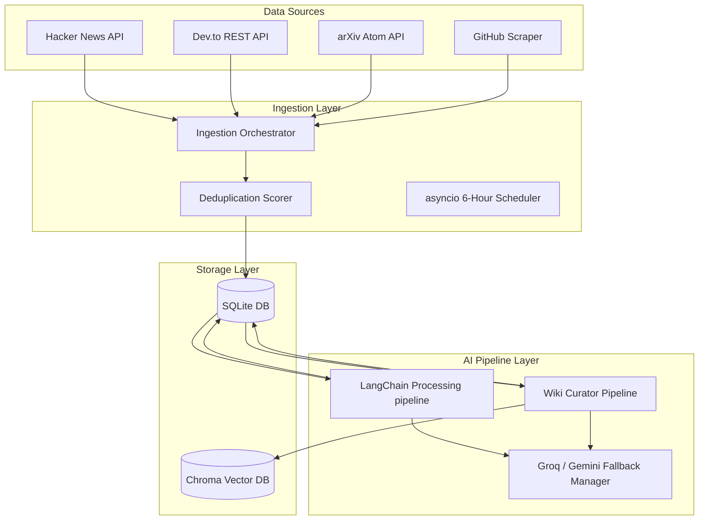

# Dev Patrika: Backend Engine Overview

This document provides a professional reference summary of the **Dev Patrika** backend engine architecture, capabilities, and API endpoints implemented up to `v0.5.0-beta`.

---

## 🏗️ System Architecture

Dev Patrika's backend is a modular developer intelligence engine built using **FastAPI**, **SQLModel (SQLAlchemy)**, and **LangChain**. The system combines a relational storage layer (**SQLite**) for structured records and a vector storage layer (**Chroma DB**) for semantic conceptual lookups.

---

## 🎯 Key Capabilities & Core Engines

### 1. Multi-Source Ingestion Engine
* Automatically crawls and extracts tech updates from the developer ecosystem:
  * **Hacker News**: Firebase REST API (top stories).
  * **Dev.to**: RSS/API endpoints matching tech tags (Python, Web Dev, DevOps, AI, Security).
  * **arXiv**: Public Atom feeds for Computer Science and Machine Learning preprints (`cs.AI`, `cs.LG`, `cs.SE`).
  * **GitHub**: Scrapes daily trending repository metrics (languages, descriptions, stars).

### 2. Duplication & Overlap Control
* Prevents data pollution through a two-tiered check:
  * **Unique URL Index**: SQLite constraint blocks duplicate URLs on insertion.
  * **Fuzzy Title Scorer**: Computes Token-based Jaccard similarity. Stories with **>80% similarity** to articles ingested in the last 24 hours are skipped, maintaining diverse topics.

### 3. Asynchronous Scheduler
* Integrates a non-blocking `asyncio` task loop running inside the FastAPI lifespan context.
* Polls data feeds automatically every **6 hours** and sequences three distinct phases: Ingestion -> News Summarization -> Auto-Wiki Curation.

### 4. AI Summarization & Classification Pipeline
* Leverages LangChain's `RunnableSequence` to transform raw descriptions/abstracts into structured, professional markdown.
* **Unified Summary Format**:
  * **Overview**: Concise 1-2 sentence introduction of the news item.
  * **Key Details**: 3-4 bullet-point takeaways.
  * **Community & Traction**: Popularity, developer activity, and adoption context.
* **AI Categorizer**: Classifies stories into tech buckets (*AI, Web Dev, Cybersecurity, Startups, Open Source, Cloud/DevOps*).
* **GitHub "Why it Matters" Radar**: Evaluates trending repos to detail architectural highlights and developer-focused summaries.

### 5. Multi-Provider LLM Fallback (Failover Engine)
* Uses native LangChain model fallbacks to guarantee uptime:
  * **Primary Model**: Groq (`openai/gpt-oss-120b`).
  * **Secondary Backup**: Google Gemini (`gemini-2.5-flash`).
  * If the primary model encounters rate limits, timeouts, or authentication issues, it fails over to the backup instantly and silently.

### 6. Dev Wiki Compiler
* Automatically compiles a dictionary of technical concepts on-demand.
* Extracts structured definitions, context on why the term is trending, and verified official resource links.

### 7. Local Vector Store & Semantic Search Engine
* Connects to a persistent local Chroma DB database located at `Backend/chroma_db/`.
* Converts text definitions into vectors using Google GenAI's **`gemini-embedding-2`** embeddings model.
* Performs semantic cosine similarity lookup: returns matching concept glossary definitions based on meaning, bypassing strict keyword matches (e.g., query `"stateful multi-agent systems"` matches `"LangGraph"`).

### 8. Automated Wiki Curation
* Scans news stories summarized during the scheduler cycle.
* Prompts the LLM (using the fallback chain) to extract key new developer terms or libraries.
* Automatically creates wiki definitions for missing concepts and indexes them in Chroma DB, building a self-expanding technical glossary.

### 9. Trending Topics Engine
* Scans news updates processed in the last 7 days and tallies keyword references of all active Wiki terms.
* Computes trajectory indicators (`"up"`, `"down"`, or `"stable"`) based on previous frequency counts and saves them in the `trending_topics` table.

### 10. Weekly AI Reports Compiler
* Gathers the past week's top stories, trending github projects, and topics count logs.
* Employs the LLM chain to compile a professional, editorial developer digest report in markdown, which is saved in `weekly_reports`.

### 11. Conversational Memory & Persistent Chatbot
* Connects the `/api/ai/chat` endpoint to a persistent SQLite `chat_messages` table mapping message threads to user session IDs.
* Pulls current dialogue logs dynamically, maintaining memory context across multiple message turns.

### 12. Context Retrieval & Structured Citation Engine
* Executes parallel semantic retrievals on Chroma collections (`wiki_entries` and `news_items`).
* Directs the LLM router to ground answers in the fetched materials, forcing numeric references (like `[1]`, `[2]`), and returns a list of verified clickable URLs in the JSON API payload.

### 13. Technology Evolution Timelines
* Dynamically compiles chronological developmental phases (Announcement ➔ Adoption ➔ Production ➔ Growth) for any technical term using database references and parametric model intelligence.

### 14. Related Articles Recommendations
* Enables semantic recommender widgets on articles.
* Queries vector similarity indexes in Chroma to fetch 3 semantically close articles for every news item.

### 15. Premium Markdown & UI Curation Engine
* Employs custom React parser modules to translate structured Markdown (headers, lists, bold/italic inline tags, dividers, code blocks, and matrices) into premium web UI components.
* Automatically converts unformatted milestone charts into clean, tabular grids under evolution timelines and weekly digests.
* Dynamically normalizes all external links (Wiki references, GitHub redirects) to enforce absolute protocols (`https://`), preventing local path breakage and ensuring seamless routing.

---

## 🔌 API Endpoints Summary

| Method | Endpoint | Description | Lifecycle Group |
|:---|:---|:---|:---|
| **GET** | `/api/health` | Service health status check. | System |
| **GET** | `/api/news` | Retrieve daily news feeds with category, query, and limit filters. | News |
| **GET** | `/api/news/{news_id}` | Retrieve details of a single news article by ID. | News |
| **POST** | `/api/news/ingest` | Triggers background crawlers and initiates LLM processing. | News |
| **POST** | `/api/news/process` | Processes pending raw items in the DB via AI pipeline. | News |
| **GET** | `/api/github/trending` | Returns stored repository radar with AI summaries. | GitHub Radar |
| **GET** | `/api/github/repo/{repo_id}` | Fetch details of a single trending repository by ID. | GitHub Radar |
| **GET** | `/api/wiki` | Returns list of concept definitions with autocomplete query support. | Dev Wiki |
| **GET** | `/api/wiki/{term}` | Fetch case-insensitive wiki entries. | Dev Wiki |
| **POST** | `/api/wiki/generate` | Dispatch LangChain worker to generate concept definitions. | Dev Wiki |
| **GET** | `/api/wiki/{term}/timeline` | Generate chronological evolution timeline for a tech term. | Dev Wiki |
| **GET** | `/api/search` | Unified parallel search querying news & repos (SQL) and wiki concepts (Chroma). | Search |
| **GET** | `/api/news/{news_id}/related` | Retrieve semantically related news articles. | News |
| **GET** | `/api/reports/weekly` | Retrieve historical list of weekly reports. | Reports |
| **GET** | `/api/reports/weekly/{report_id}` | Retrieve details of a specific weekly report. | Reports |
| **POST** | `/api/reports/weekly/compile` | Manually compile a new weekly developer report. | Reports |
| **GET** | `/api/ai/models` | Retrieve lists of supported active LLM models. | AI Engine |
| **POST** | `/api/ai/chat` | Conversational RAG chatbot with history memory and citations. | AI Engine |
