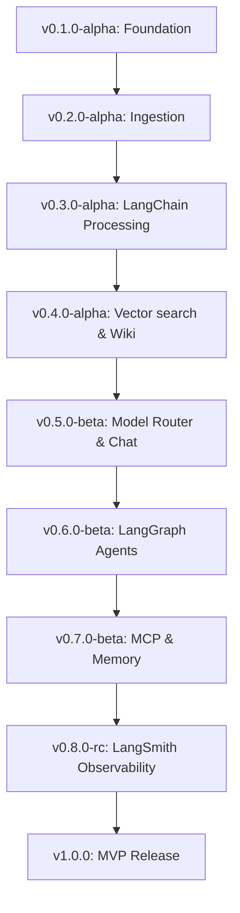

# Dev Patrika: Comprehensive Backend Release Roadmap & Versioning Plan

This document serves as the master blueprint and release roadmap for the **Dev Patrika** backend. It extracts all backend-relevant requirements, modules, engineering phases, and tools from the project proposal and maps them systematically into versioned milestones.

---

## 🏗️ Part 1: System Architecture & Requirements

### 1. Database Schema & Storage System
* **SQLite (Relational Database)**: Stores structured metadata, news items, and workspaces.
  * `news_items`: `id` (UUID), `title`, `url`, `summary`, `category` (AI, Web Dev, Cybersecurity, Startups, Open Source, Cloud/DevOps), `source` (Hacker News, Dev.to, GitHub Trending, arXiv), `published_at` (datetime), `created_at` (datetime), `raw_content` (text), `freshness_tag` (text - e.g., "2 hours ago", "Updated today").
  * `wiki_entries`: `id` (UUID), `term`, `definition`, `why_trending`, `related_links` (JSON array), `created_at`, `updated_at`.
  * `github_radar`: `id` (UUID), `repo_name`, `repo_url`, `description`, `why_it_matters_summary`, `stars_count`, `created_at`.
  * `personal_notes`: `id` (UUID), `title`, `content`, `created_at`, `updated_at`.
* **Chroma DB (Vector Database)**: Enables semantic vector search over developer terms, tools, and companies.
  * Documents: Wiki entry definition + why it's trending.
  * Metadata: `term`, `wiki_entry_id`, `category`.

### 2. API Endpoints Specification
* **News & Ingestion Router (`/api/news`)**
  * `GET /api/news`: Retrieve categorized feed with options for category filtering, interest tags, search queries, pagination, and freshness limits.
  * `POST /api/news/ingest`: Trigger background news ingestion and processing.
* **Dev Wiki Router (`/api/wiki`)**
  * `GET /api/wiki`: List/autocomplete dev wiki terms.
  * `GET /api/wiki/{term}`: Fetch detailed concept definition, trends, and links.
  * `POST /api/wiki/generate`: Manually trigger a LangChain wiki generation task for a specific term.
* **GitHub Radar Router (`/api/github`)**
  * `GET /api/github/trending`: Get daily/weekly repo radar with AI "why it matters" summaries.
* **Search Router (`/api/search`)**
  * `GET /api/search`: Unified cross-search returning results from SQLite (News + Repos) and Chroma DB (Wiki terms).
* **AI & Model Router (`/api/ai`)**
  * `POST /api/ai/chat`: RAG-powered endpoint using a user-selected model (Gemini, Groq, Hugging Face).
  * `GET /api/ai/models`: Get list of active LLM providers and models available.

---

## 🗺️ Part 2: Version Milestones & Release Plan

### 📂 `v0.1.0-alpha` — Project Skeleton & Database schemas
* **Goal**: Establish the base directory structure, developer configurations, database engines, and database migrations.
* **Backend Deliverables**:
  * Folder architecture (`app/main.py`, `app/models.py`, `app/database.py`, etc.).
  * SQLModel / SQLAlchemy configuration setup targeting `dev_patrika.db`.
  * Database tables initialized: `news_items`, `wiki_entries`, `github_radar`.
  * Environment configuration via Pydantic settings loading variables from `.env`.
  * Initial health API endpoint (`GET /api/health`) and basic API router registry.
  * Project initialization with Git, default `.gitignore`, and `requirements.txt`.

### 📡 `v0.2.0-alpha` — News Ingestion & Document Loaders
* **Goal**: Connect target RSS and REST feeds, parse documents using standard frameworks, and extract raw technical news with timestamps.
* **Backend Deliverables**:
  * Ingestion client modules inside `app/services/ingestion/` using **LangChain Document Loaders**:
    * **Hacker News Loader**: Fetch top/new stories via Hacker News Firebase API.
    * **Dev.to Loader**: Fetch latest articles using tag parameters.
    * **arXiv Loader**: Fetch new computer science and machine learning preprints.
    * **GitHub Trending Loader**: Fetch trending repo stats.
  * Setup background task schedulers utilizing FastAPI's `BackgroundTasks` to automatically poll feeds every 6 hours.
  * Store timestamps and **freshness metadata** (e.g., "Updated today", "2 hours ago") for all ingested content.
  * Duplicate detection logic to ensure identical URLs are not ingested twice.

### 🧠 `v0.3.0-alpha` — LangChain Core Processing & Tools
* **Goal**: Configure LLM templates, parsers, and custom tools to clean, summarize, and categorize ingested raw articles.
* **Backend Deliverables**:
  * Integration of LangChain Runnable interfaces (`RunnableSequence`) mapping raw content to structured output.
  * **Text Splitters**: Split long articles/documents into semantic chunks before embedding and summarization.
  * **Prompt Templates**: Create reusable templates for news summarization, category classification, and wiki generation.
  * **Structured Output Parsers**: Parse LLM responses using structured output schemas (Pydantic / JSON schema).
  * **Classifier Component**: Structured output parser assigning one of the six categories (AI, Web Dev, Cybersecurity, Startups, Open Source, Cloud/DevOps).
  * **Summarizer Component**: Generate bullet-point summaries, preserve original article metadata, and maintain **source attribution** throughout the pipeline.
  * **Initial LangChain Tools**:
    * **News Search Tool**: Semantic search over local SQLite articles.
    * **GitHub Search Tool**: Search repositories and issues.
    * **URL Summarizer Tool**: Scrape and summarize linked pages on-the-fly.
  * **Simple Single-Purpose Agents**: Build lightweight LangChain agents (not LangGraph yet) for automated news summarization and wiki definition creation.
  * LLM Provider fallback logic (falls back to Gemini if Groq API rate-limit errors are encountered).
  * Automatic updating of the database with the generated summaries and categories.

### 📖 `v0.4.0-alpha` — Dev Wiki & Semantic Search
* **Goal**: Auto-generate Wiki entries for new tech terms and build the vector database search layer.
* **Backend Deliverables**:
  * Local Chroma DB directory setup and integration as a LangChain vector store client.
  * **Wiki curator pipeline**:
    * LLM chain that processes incoming daily summaries and identifies new/trending terms, companies, or tools.
    * Generator chain that writes a description, "Why it's trending" paragraph, and scrapes/attaches reference links.
  * Script to vectorize and upsert Wiki pages into Chroma DB.
  * Build semantic **Retrievers** for Dev Wiki search.
  * Endpoint `GET /api/search` which triggers a parallel retrieval: SQL semantic matches for news and Vector Cosine Similarity lookup for wiki entries.

### 🔀 `v0.5.0-beta` — Model Router & Conversational API
* **Goal**: Build the runtime LLM switcher and baseline chat assistant configuration.
* **Backend Deliverables**:
  * Model Router API endpoint (`GET /api/ai/models` and router orchestration):
    * Switches dynamically between **Gemini** (Google), **Llama/Mixtral** (via Groq), and **Hugging Face** endpoints.
  * First implementation of `POST /api/ai/chat` utilizing LangChain `ConversationChain` with memory, capable of processing simple Q&A.
  * Endpoints supporting localStorage state (fetching customized feeds based on user interest tags).

### 🕸️ `v0.6.0-beta` — LangGraph Multi-Agent Workflows
* **Goal**: Replace linear chains with stateful, loop-capable agent workflows.
* **Backend Deliverables**:
  * Setup LangGraph environment.
  * **Daily Brief Agent**: A graph orchestrating: Fetching -> Deduplication -> Summarization -> Classification -> Publishing state updates.
  * **Wiki Curator Agent**: Manage trending term definitions and resolve wiki conflicts.
  * **Research Digest Agent**: Ingest arXiv PDFs, split chunks, and translate them into non-technical developer updates.
  * **Explain Why Agent**: Resolves deep-dive queries by executing tools to fetch GitHub PRs, external API documentations, and historical news.

### 🔌 `v0.7.0-beta` — MCP Tools & Human-in-the-Loop moderation
* **Goal**: Support Model Context Protocol tool definitions and strict review checkpoints.
* **Backend Deliverables**:
  * Build MCP server configurations to support standardized tools.
  * Phase 2 Tool Integrations:
    * **Research Paper Tool**: Deep academic search.
    * **YouTube Transcript Tool**: Parse and summarize video transcripts.
    * **Documentation Search Tool**: Index and search third-party dev docs.
    * **Bookmark Manager**: Manage workspaces.
    * **Personal Notes Tool**: Persist notes.
    * **Calculator** & **Time Utility Tools**: Helper modules.
  * Define **Human-in-the-Loop** approval states in LangGraph:
    * Interrupted execution saving state to SQLite for human authorization before news publishing or wiki edits are committed.
  * Configure persistent SQLite-backed checkpointers for cross-run memory.

### 📊 `v0.8.0-rc` — LangSmith Polish & Evaluations
* **Goal**: Audit quality, track costs, and add observability layers.
* **Backend Deliverables**:
  * LangSmith tracing hooks integrated into the agent execution pipelines.
  * Auto-evaluation test suites executing in the background:
    * Faithfulness scorer (verifying summaries don't hallucinate context).
    * Relevance scorer (checking wiki search matching quality).
  * Prompt management configuration via LangSmith Hub for prompt versioning and hot-swaps.
  * Middleware logging API call latencies, token consumption, and compute costs.

### 🚀 `v1.0.0` — Production MVP Launch
* **Goal**: Freeze backend code, optimize caching, and deploy ready package.
* **Backend Deliverables**:
  * Swagger documentation finalized.
  * FastAPI CORS middleware restricted and API rate limiter using slowapi.
  * **AI Disclaimer**: Add AI-generated content disclaimer metadata inside every API response.
  * **Editorial Guidelines**: Document editorial verification guidelines for verifying and correcting AI-generated summaries.
  * Production deployment guide with Docker, Docker Compose, and environment parameters.

---

## 🛠️ Branching & Verification Strategy

To commit this release roadmap:
1. We will check out a dedicated branch: `docs/version-roadmap`.
2. Stage and commit this roadmap file locally.
3. We will request your explicit approval **before** pushing this branch to GitHub.
